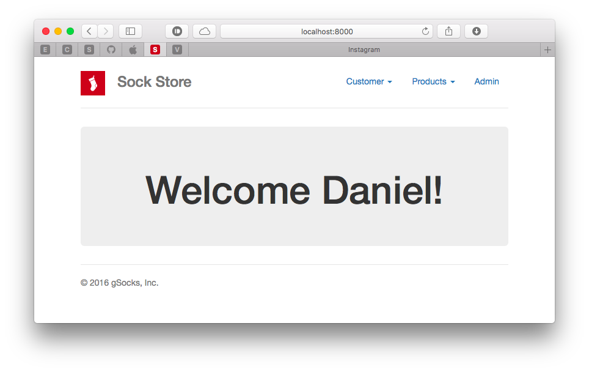

# 	Lab3.

> - En el laboratorio anterior se creo el modelo del producto a vender en nuestro eCommerce. 
> - En esta entrega he:
>   - Construido la vista de añadir productos y la vista de listado de productos.
>   - Además de modificar el "index" de forma que dé la bienvenida al usuario.

## Bienvenida.

## Vista de añadir productos.

### Template.  

### View.

### Render.  

## Vista de listar productos.

###  Template.

### View.

### Render.