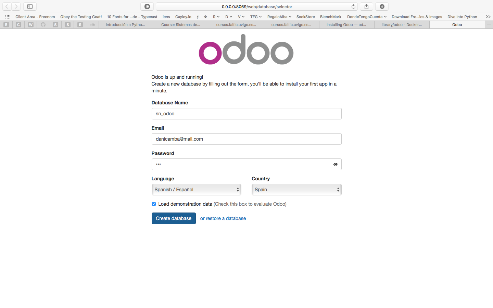
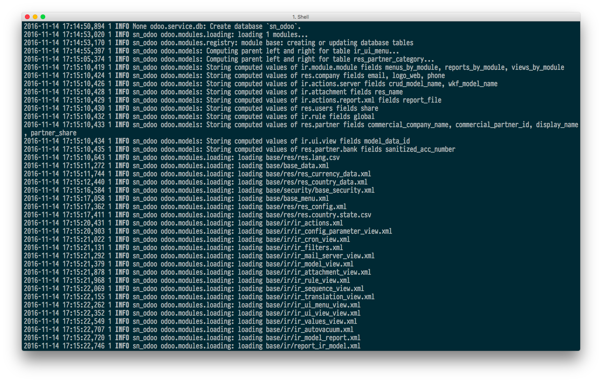
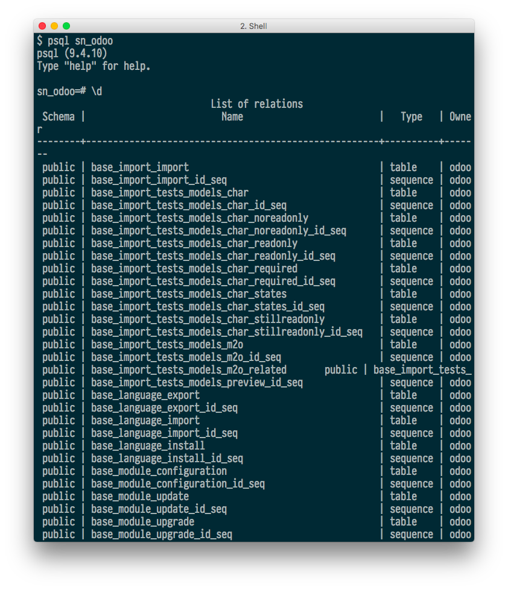
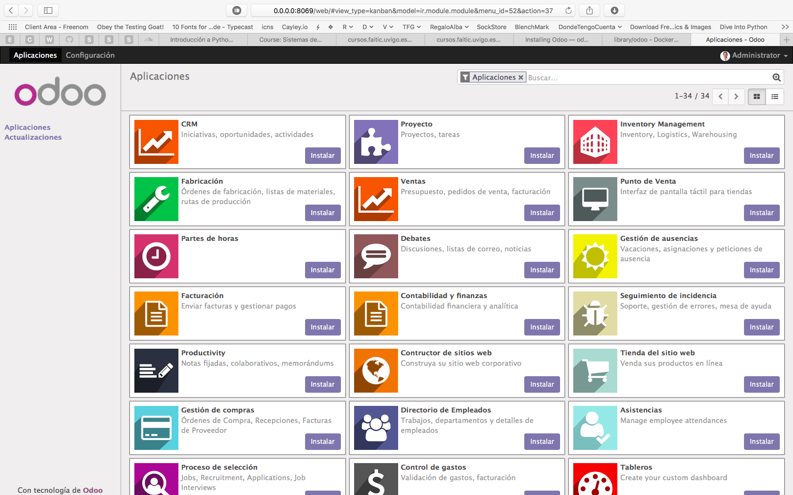
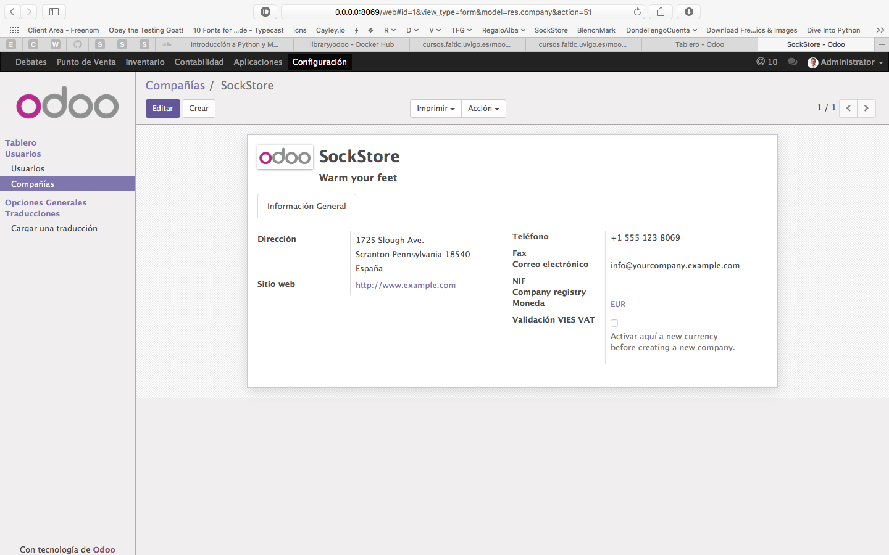
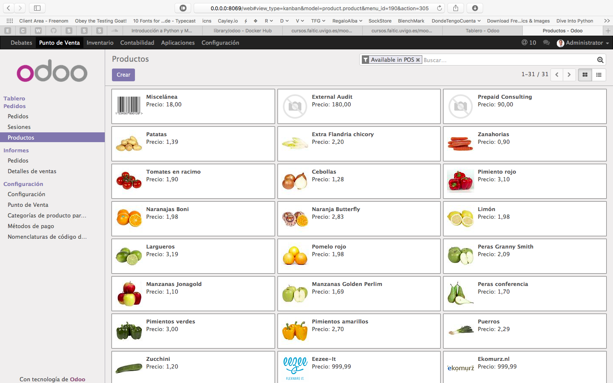
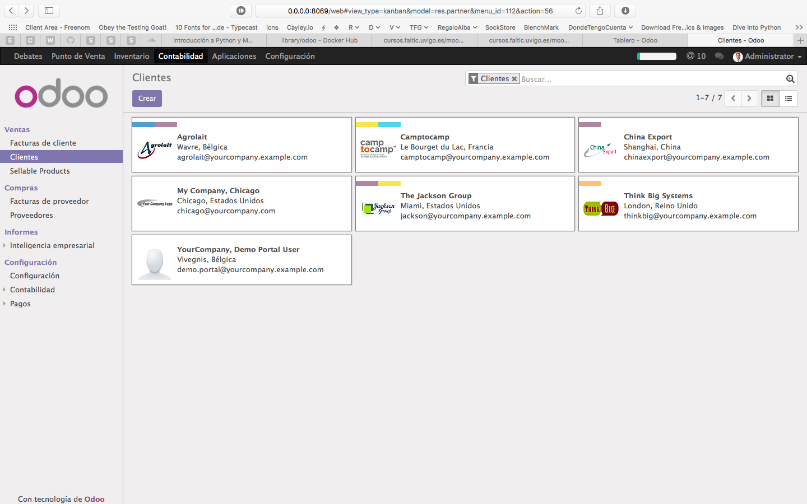

# Lab 6: Very basics of Using Odoo.
> Daniel Camba Lamas

## Install the latest Odoo-v9 and create a database.

> Lo he hecho desde MacOS por lo que para simplificarme la existencia he utilizado Docker, los pasos (suponiendo Docker instalado) son los siguientes.

1. `docker pull odoo`
2. `docker run -d -e POSTGRES_USER=odoo -e POSTGRES_PASSWORD=odoo --name db postgres:9.4`
3. `docker run -p 8069:8069 --name odoo --link db:db -t odoo`

De esta forma ya tendríamos abierta una instancia de *Odoo* totalmente funcional, accedemos a ella desde `http://0.0.0.0:8069` y visualizamos un formulario para crear nuestra primera base de datos las cual rellenará con datos de muestra si así lo queremos. **Ésta _base de datos_ se crea con 189 filas**.

Lo cual por detrás hace algo similar a...

Para generar la susodicha base de datos, que se parece a...

Para finalmente visualizar en el navgador lo siguiente...

## Create a Company (invent a name) that you will use throughout this lab.

### View Products (_auto added_).

### View Clients (_auto added_). 
