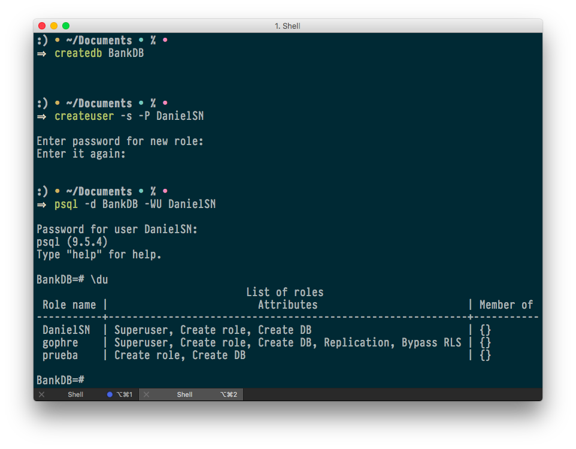
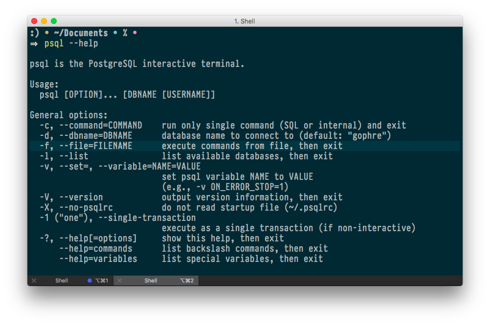
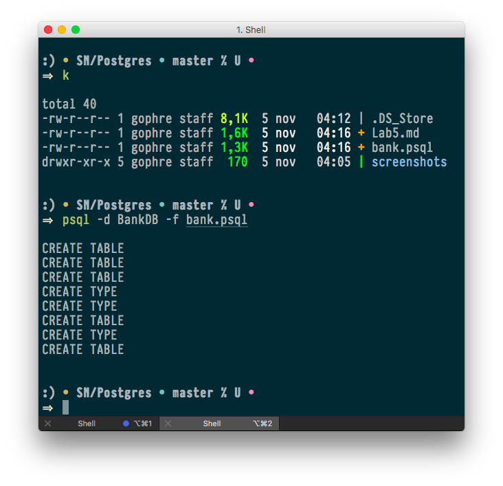
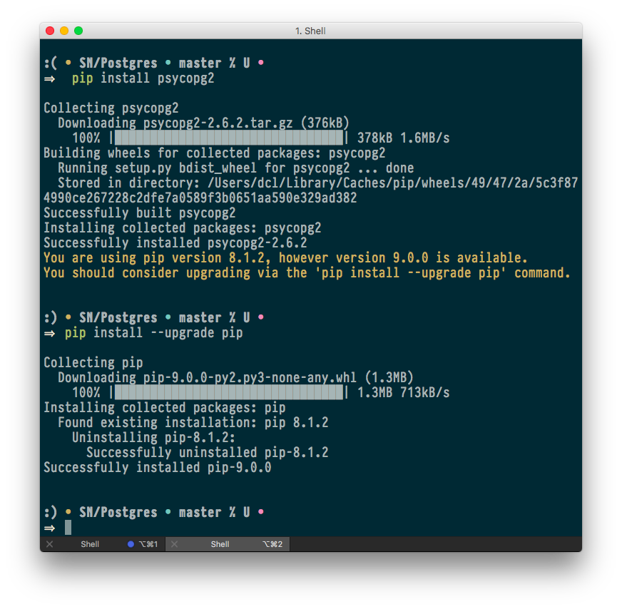
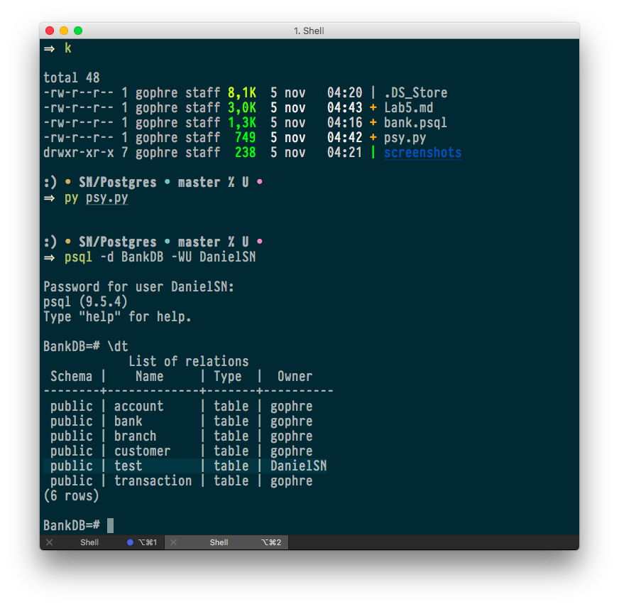
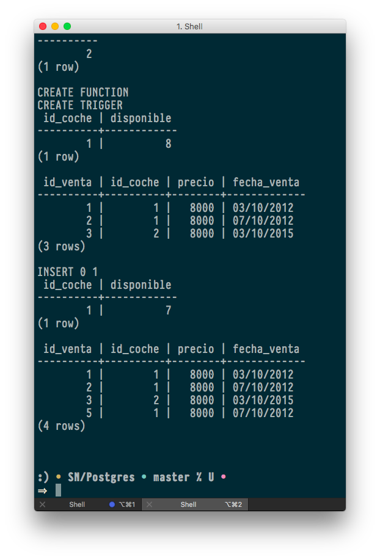

# A first contact with PostgreSQL.

## Install.

 

## 1.- Role, Database, Conection.

En _createuser, **-s**_ nos sirve para darle los permisos de un supserusuario al usuario que estamos creando.

En _createuser, **-P**_ nos sirve para obligar al usuario a definir su contraseña.

En _psql, **-d**_ nos sirve para indicar que el siguiente parámetro es el nombre de la base de datos.

En _psql, **-W**_ nos sirve para obligar la solicitud del password.

En _psql, **-U**_ nos sirve para indicar que el siguiente parámetro es el nombre del usuario.



## 2.- BankDB.

### Write a SQL script.

```plsql
CREATE TABLE bank (
    bank_id integer NOT NULL,
    bank_name text,
    bank_adress text,
    PRIMARY KEY(bank_id)
);
CREATE TABLE branch (
    branch_id integer NOT NULL,
    bank_fk integer REFERENCES bank(bank_id),
    branch_adress text,
    branch_tlf numeric,
    PRIMARY KEY(branch_id, bank_fk)
);
CREATE TABLE customer (
    customer_id integer NOT NULL,
    customer_ssn numeric UNIQUE NOT NULL,
    customer_name text,
    customer_adress text,
    PRIMARY KEY(customer_id)
);
CREATE TYPE account_currency_enum AS ENUM ('€', '$', '£');
CREATE TYPE account_type_enum AS ENUM ('standard', 'plus', 'premium');
CREATE TABLE account (
    customer_id integer REFERENCES customer(customer_id),
    account_id integer NOT NULL,
    account_type account_type_enum NOT NULL,
    account_currency account_currency_enum NOT NULL,
    balance numeric,
    PRIMARY KEY(account_id),
    UNIQUE(customer_id, account_id)
);
CREATE TYPE transaction_type_enum AS ENUM (
    'purchase', 'loan', 'montage', 'bank', 'credit', 'debit');
CREATE TABLE transaction (
    account_fk integer REFERENCES account(account_id),
    transaction_date timestamp WITH time zone,
    transaction_type transaction_type_enum,
    amount numeric,
    PRIMARY KEY(account_fk, transaction_date)
);
```

### Load the script.
 

 

## 3.- Using PSYCOPG2.

### Install.

 

### Write a script.

```python
import psycopg2

# Abre la conexion con la db y un usuario concreto.
conn = psycopg2.connect("dbname=BankDB user=DanielSN")
# Concede un 'cursor' con el que trabajar contra la base de datos.
cur = conn.cursor()

# Crea una nueva tabla.
cur.execute("CREATE TABLE test (id serial PRIMARY KEY, num integer, data varchar);")
# A la tabla anterior, introduce datos.
cur.execute("INSERT INTO test (num, data) VALUES (%s, %s)", (100, "abc'def"))
# Obten una lista en base al 'Select'.
cur.execute("SELECT * FROM test;")
# Iterando sobre la lista previa, retorna el primer elemento.
cur.fetchone()

# Convierte en persistentes los cambios realizados en la base de datos.
conn.commit()

# Cerrar el cursor y la propia conexion.
cur.close()
conn.close()
```

### Run script.

 

## 4.- SELECTs y TRIGGER.

### Script PL/psql.

```plsql
-- ...DEFINICION BASE DE DATOS...
-- Creacion de tablas.
 create table coche (
    id_coche integer not null,
    marca varchar(30),
    modelo Varchar(30),
    color varchar(30),
    primary key( id_coche)
);
create table venta (
    id_venta integer not null,
    id_coche integer,
    precio integer,
    fecha_venta varchar(30),
    primary key (id_venta)
);
create table stock (
    id_coche integer not null,
    disponible integer,
    primary key(id_coche)
);
-- Inserccion de datos de prueba.
insert into coche (id_coche, marca, modelo, color)
     values (0001, 'Citroen', 'Picaso', 'Blanco');
insert into coche (id_coche, marca, modelo, color)
    values (0002, 'Citroen', 'Picaso', 'Negro');
insert into coche (id_coche, marca, modelo, color)
    values (0003, 'Citroen', 'Picaso', 'Rojo');
insert into coche (id_coche, marca, modelo, color)
    values (0004, 'Citroen', 'Picaso', 'Azul');
insert into coche (id_coche, marca, modelo, color)
    values (0005, 'Citroen', 'Picasa', 'Rojo');
insert into stock (id_coche, disponible)
    values (0001, 8);
insert into venta (id_venta, id_coche, precio, fecha_venta)
    values (1,0001,8000,'03/10/2012');
insert into venta (id_venta, id_coche, precio, fecha_venta)
    values (2,0001,8000,'07/10/2012');
insert into venta (id_venta, id_coche, precio, fecha_venta)
    values (3,0002,8000,'03/10/2015');

-- ...SELECTS_BASICOS...
-- Seleccionar todos los coches rojos.
select *
from coche
where color = 'Rojo';
-- Seleccionar el id de todos los cocoches vendidos el año pasado.
select coche.id_coche
from coche
left join venta on coche.id_coche = venta.id_coche
where fecha_venta like '%2015';

-- ...TRIGGER...
-- DEFINICION TRIGGER.
-- Funcion a lanzar por el trigger.
CREATE OR REPLACE FUNCTION venta_menos_stock()
RETURNS TRIGGER AS $$
BEGIN
    UPDATE stock
    SET disponible = disponible - 1
    WHERE stock.id_coche = new.id_coche;
    RETURN new;
END;
$$ language plpgsql;

-- Trigger a lanzar cuando se registra una nueva venta.
CREATE TRIGGER nueva_venta
AFTER INSERT ON venta
FOR EACH ROW
EXECUTE PROCEDURE venta_menos_stock();

-- COMPROBACION.
-- Comprobamos el estado actual de ambas tablas.
select * from stock;
select * from venta;

-- Hacemos una inserccion en venta para activar el trigger.
insert into venta (id_venta, id_coche, precio, fecha_venta) values (5,0001,8000,'07/10/2012');

-- Comprobamos ambas tablas tras la inserccion, comprando el trigger.
select * from stock;
select * from venta;
```

### Verificación del funcionamiento del trigger.

 