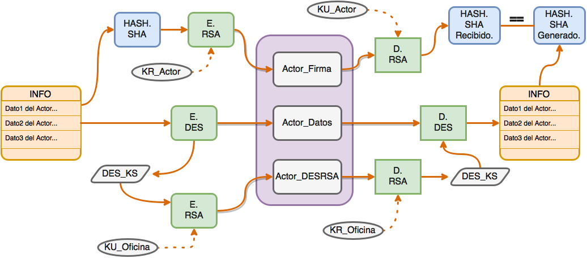

# SSI - CompostelaVirtual - Práctica1.

> **Daniel Camba Lamas.**
>
> En colaboración con: Diego Casanova José y Román Puga Quintairos

## Descripción breve de la práctica.

Se pretende construir un sistema que permita de forma segura (utilizando diferentes métodos de encriptación), verificar el paso de un peregrino por un albergue, durante la realización del Camino de Santiago.

Para ello el peregrino usará _GenerarCompostela_ con sus datos personales, componiendo de esta manera el paquete que será la compostela única he instrasferible de nuestro peregrino. Donde los albergues sellarán con _SellarCompostela_ y la oficina verificará con _DesempaquetarCompostela_.

## Descripción y justificación de las estrategias criptográficas empleadas para asegurar los requisitos básicos exigidos, junto con los pasos que se siguen en el empaquetado, sellado y desempaquetado.

 

Los bloques de Peregrino y Albergue se generan de la misma manera, de forma que sólo se puedan verificar en destino ya que parte del bloque está encriptado con la clave pública de la oficina. A mayores para comprobar si alguna parte ha sido modificada, tanto en el Peregrino como en el Albergue, se generan dos bloques con los mismos datos empaquetados de diferentes maneras, de forma que al hacer las comprobaciones correctas en destino ambos bloques, deberían ser idénticos.

## Descripción del formato/estructura del "paquete" resultante.

### El paquete resultado para una ejecución del script de prueba anexado más abajo es el siguiente:

```java
-----BEGIN PACKAGE-----
-----BEGIN BLOCK ALB1_DATOS-----
yxxxHf1/tPfhhiTjv0IL1Qaf3O9IIAWBBbCM5+AKUCePUArwXKSChJX2wfIHDOOVS
NT1hoxktId9JY/xPH0MAw==
-----END BLOCK ALB1_DATOS-----
-----BEGIN BLOCK ALB1_DESRSA-----
e9ZSZhcjiuzQDwCJBPikaopekhjS/4lvSMr0qHTIFHA9xnrey1PQ9aVSGHz3n1YLF
HeDGhm4xU44jCjO14S+qA==
-----END BLOCK ALB1_DESRSA-----
-----BEGIN BLOCK ALB1_FIRMA-----
JQyTkXsAsT50kHmIDzXd3dxUtTc7qUi7sFQyjYOGgFP8TL5bROTdA54NO/HPSQWVD
MBkbgGlVwSf0bqagqrGVQ==
-----END BLOCK ALB1_FIRMA-----
-----BEGIN BLOCK ALB2_DATOS-----
kvI/oESwn5IlU1SL1f41UlZCDIVNSvO8NNiFVls2iVTBvG+TjorxwSzFYH2DSbvm9
hR42vyyk2g=
-----END BLOCK ALB2_DATOS-----
-----BEGIN BLOCK ALB2_DESRSA-----
Rzh+OazlifZXGtSxCTBIxwIQalEpcMF7gF2/upq0WYd+rEjC+UaZ7DJG5oYK8yXBi
FG+unje43AaIv7cPaixVQ==
-----END BLOCK ALB2_DESRSA-----
-----BEGIN BLOCK ALB2_FIRMA-----
axWUI0piZ/YUhnpMsfQg69GHyN64ODKiqqzk3MSnMACAIScljYsGxiilY7RMboyWi
mVwGht17QpMPoWjFecrBg==
-----END BLOCK ALB2_FIRMA-----
-----BEGIN BLOCK PEREGRINO_DATOS-----
AowttB6kVHtTKV0QGaEd+Ifkl1xf2+OERXUAsE2uY2nlwuz5If/lRYGKA7E+Rw+vx
ctHlnNVNxVikURPvAM9rl/woIYdFgQBu+nvph4gJPruQe3HE2hsRg==
-----END BLOCK PEREGRINO_DATOS-----
-----BEGIN BLOCK PEREGRINO_DESRSA-----
aRSr/e7ATAtog6cvzSyXlHicsyHxVynJcyvVyrNjpF0PZZq8Et6aQbANqkkYqmble
1oAKjEurlRo02Q+otAkmQ==
-----END BLOCK PEREGRINO_DESRSA-----
-----BEGIN BLOCK PEREGRINO_FIRMA-----
fQ6ewfuVOqaFqFXCg/WZz9Pk4U0Uh5D9hIFirGbZ5FV9mo0bs2WAcnUCaUcYk4moY
bVXXLPRbHcCjbR0uDEJMQ==
-----END BLOCK PEREGRINO_FIRMA-----
-----END PACKAGE-----

```

Podemos ver claramente como para cada uno de los actores (Peregrino, Albergue1, Albergue2), se crean _3 bloques_ con su Firma(_Hash+RSA_ sobre la info de cada actor), Datos(_DES sobre la info de cada actor_) y DESRSA(_RSA sobre clave DES de Datos_).

## Descripción breve de la implementación: clases y métodos más importantes.

### BCTools.

```java
// Genera una Firma, aplicando un HASH a los datos y encriptandolo con RSA usando la clave privada recibida.
public static Bloque genFirma(
	String block, String kr, byte[] data )

// Genera un bloque Datos, encriptando la información recibida con DES y encripta la clave de éste DES con RSA usando la clave publica recibida (que deberá ser de la oficina).
public static Bloque[] genDatos(
	String block1, String block2, String ku, byte[] data )

// Dados unos datos, aplica un HASH con SHA y retorna el resumen generado.
public static byte[] genHash( byte[] data )
  
// Obtienen los bloques con la Firma, Datos y clave DES cifrada en RSA; respectivamente.
public static byte[] getFirma(
        Paquete pack, String block, String k )
public static byte[] getDatos(
        Paquete pack, String block, byte[] k )
public static byte[] getDESRSA(
        Paquete pack, String block, String k )
  
// Utilizando el paquete:
//import java.security.spec.*;
// Obtiene de los bytes de un archivo la clave RSA privada y pública respectivamente.
public static PrivateKey getKR( byte[] k )
public static PublicKey getKU( byte[] k )
  
// Utilizando los paquetes:
//import java.nio.file.Path;
//import java.nio.file.Paths;
//import java.nio.file.Files;
// Convierte la string caputrada por parametro en un archivo y éste a bytes.
public static byte[] getFileInfo(String file)
```

### *GenerarCompostela*.

> **Recibe por parametro...** 
>
> - 0:Nombre_Paquete.
> - 1:KR_Peregrino.
> - 2: KU_Oficina.

Es la encargada de generar la compostela del peregrino donde a posteriori sellarán los albergues y verificará la oficina.

Para ello utilizando *BCTools* y pasando los parametros correspondientes, se le piden al peregrino los datos, se empaquetan en `JSON` y convierten a `byte[]` para poder generar la _Firma_, los _Datos_ y _el empaquetado RSA de la clave DES de los datos_. Por último crea un paquete donde introducirá los bloques antes dichos y lo escribirá en disco con el nombre pasado en el parametro 0 por consola.

### _SellarCompostela_.

> **Recibe por parametro…**
>
> - 0:Compostela.
> - 1:ID_Albergue.
> - 2:KR_Albergue.
> - 3:KU_Oficina.

Realiza exactamente el mismo proceso que *GenerarCompostela*, con la salvedad de que la información solicitada es distinta y el último paso no consiste en crear un paquete, si no en actualizar el paquete dado por el Peregrino, pasado a la aplicación por el parametro 0.

### DesempaquetarCompostela.

> **Recibe por parametro…**  
>
> - 0: Compostela.
> - 1: Num_Albergues.
> - (_x_: ID_Albergue, _y_:KU_ID_Albergue)*Num_Albergues.
> - length-2: KU_Peregrino.
> - length-1:KR_Oficina.

Realiza el proceso inverso a los dos ejecutables anteriores, comienza abriendo la _Compostela_ y extrae la **clave Des** que usando RSA con su clave privada, ya que este bloque debe ser encriptado con RSA usando la clave pública de la oficina.

Luego utiliza dicha clave, para desempaquetar los datos del peregrino, y les aplica una función Hash mediante SHA.

Continua con el desempaquetado de la Firma utilizando la clave pública del peregrino.

Por último, comprueba los datos obtenidos de los dos procesos anteriores, si ambos coinciden, todo está en orden.

Repite el proceso con todos los albergues, en caso de no fallar ninguno, la _Compostela_ habrá sido verificada, en caso contrario o el peregrino es un impostor o deberán buscar una forma analógica de solucionar la problemática con algún albergue.

## Instrucciones de compilación y ejemplos de uso.

Para este apartado he automatizado el proceso y será tan sencillo como ejecutar.

```sh
./run
```

Desde tu shell favorito y como podemos ver a continuación, creará las claves para un peregrino (para el caso le he puesto mi nombre), dos albergues y la oficina; luego llama con los parametros acordados en el orden correcto a _GenerarCompostela, SellarCompostela y DesempaquetarCompostela_.

```shell
#!/usr/bin/env bash

# Recompilar todo.
javac -cp ".:bc.jar" *.java

# Generar las claves.
java -cp ".:bc.jar" GenerarClaves "Dani"
java -cp ".:bc.jar" GenerarClaves "Alb1"
java -cp ".:bc.jar" GenerarClaves "Alb2"
java -cp ".:bc.jar" GenerarClaves "Ofi"

# Generar compostela del peregrino.
echo -e "\n\nPEREGRINO! - Ejecutando: 'GenerarCompostela'"
java -cp ".:bc.jar" GenerarCompostela "DCL" Dani.privada Ofi.publica

# Sellar compostela en diferentes albergues.
echo -e "\n\nALBERGUE1! - Ejecutando: 'SellarCompostela'"
java -cp ".:bc.jar" SellarCompostela DCL.paquete "Alb1" Alb1.privada Ofi.publica
echo -e "\n\nALBERGUE2! - Ejecutando: 'SellarCompostela'"
java -cp ".:bc.jar" SellarCompostela DCL.paquete "Alb2" Alb2.privada Ofi.publica

# Verificar la validez de la compostela en la oficina.
echo -e "\n\nOFICINA! - Ejecutando: 'DesempaquetarCompostela'"
java -cp ".:bc.jar" DesempaquetarCompostela DCL.paquete 2 "Alb1" Alb1.publica "Alb2" Alb2.publica Dani.publica Ofi.privada

# Borrar todas las claves y ejecutables.
rm -f *.privada *.publica *.class
```


## Breve comentario sobre las simplificaciones realizadas (apartado 2.1) y sus consecuencias en una aplicación real.

- No se considera una protección del fichero con la clave privada.
- Las distintas piezas de información, tendrán forma de Strings en formato JSON.
- Se asumirá que todas las claves públicas necesarias estarán en poder de cualquiera.
  Considero que el cifrado del paquete y el trabajar con tipos de datos en vez de sólo cadenas de texto, son unas modificaciones asequibles y bastante necesarias sobre todo el primer punto.
  Ahora bien, la distribución de certificados es importante para saber que la clave pública que vayamos a utilizar no ha sido generado por el propio peregrino con intención de burlar nuesro sistema.


## Resultados obtenidos y conclusiones.
Los resultados obtenidos han sido una buena primera toma de contacto al manejo de datos cifrados. Nos deja entrever las cosas que se pueden mejorar y que no resulta tan dificil el correcto manejo de una API de cifrado.