# Vulnerabilidades Web y Mod-Security.
> Daniel Camba Lamas

## 1.- DESBORDAMIENTO.

El código que se nos presenta es el siguiente:
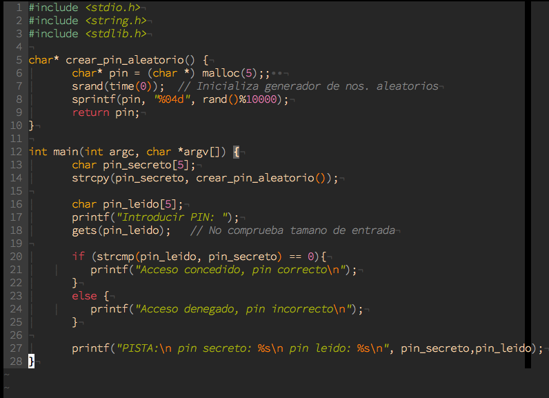

Compilamos desactivando la protección de pila:
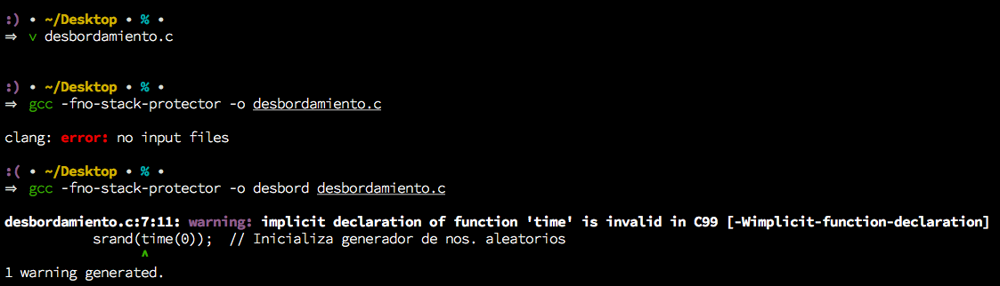

Ejecutamos (*nos notifica que `get()` es muy inseguro*) y vemos que si escribimos más de 15 caracteres, el codigo original se reescribe, si los caracteres son alfanumericos no saltaremos la seguridad ya que se reescribe sólo con cierta parte del texto de entrada por lo que al compararlo, serán diferentes. Si pasamos espacios pulsando simplemente la tecla `space`esta se envía como `\ ` por lo que la cadena de entrada seguirá teniendo mayor extensión que la cadena sobreescrita. Finalmente la solución es mandar más de 15 caracteres nulos `^@` el cual se escribe pulsando `ctrl+space`, de esta forma la cadena sobreescrita es `null` y la cadena a comparar es `null`, y dado que `null==null` es `true`, nos permite el acceso.
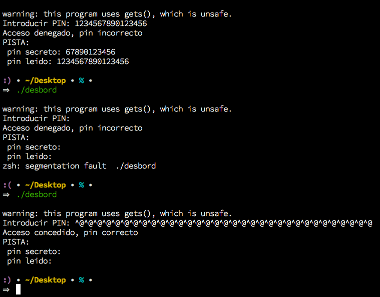

## 2.- ENTORNO DE PRUEBAS.
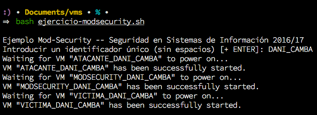

## 3.- VULNERABILIDADES.

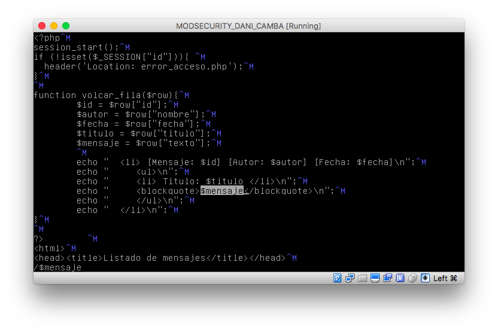
Los siguientes ejemplos (*De javascript*) son posibles, porque en php se carga la variable directamente y el navegador al detectar los tokens \<script\> \</script\> ejecuta inmediatamente lo que hay en el medio. La solución más sencilla sería utilizar la función `strval($mensaje)` de php que convierte la variable a cadena, por lo que el navegador se vería forazado a mosrar el contenido y no lo ejecutaría.

### XSS.
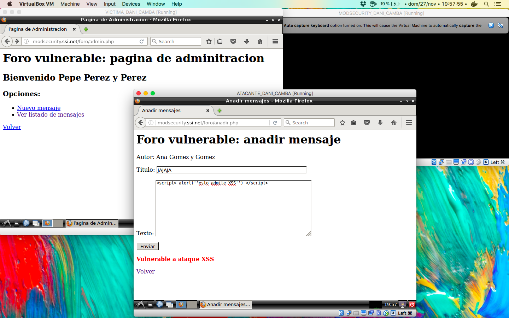
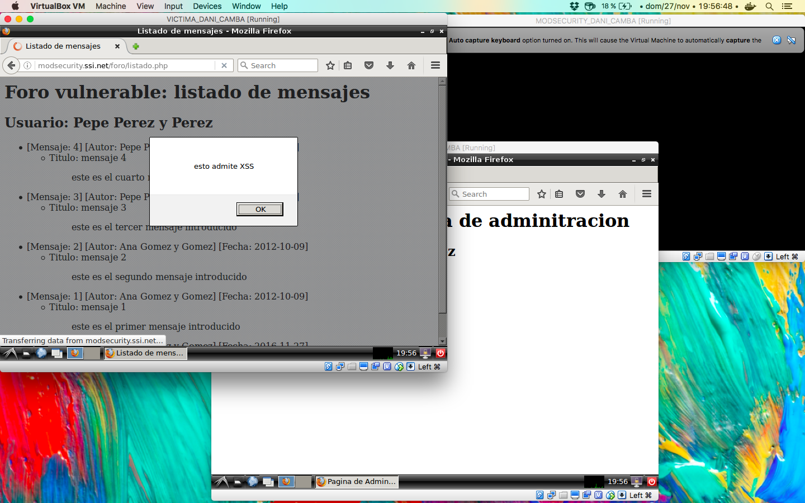

### KEYLOGGER.
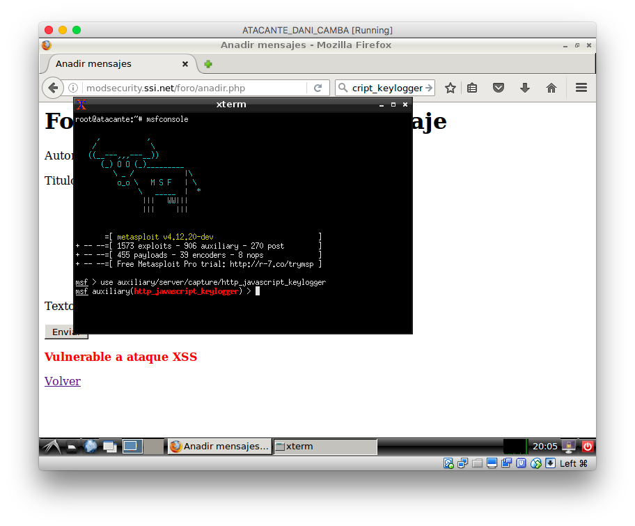
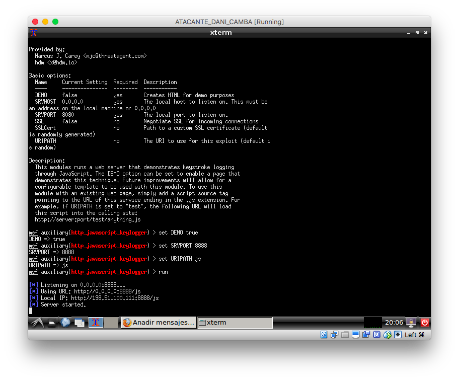
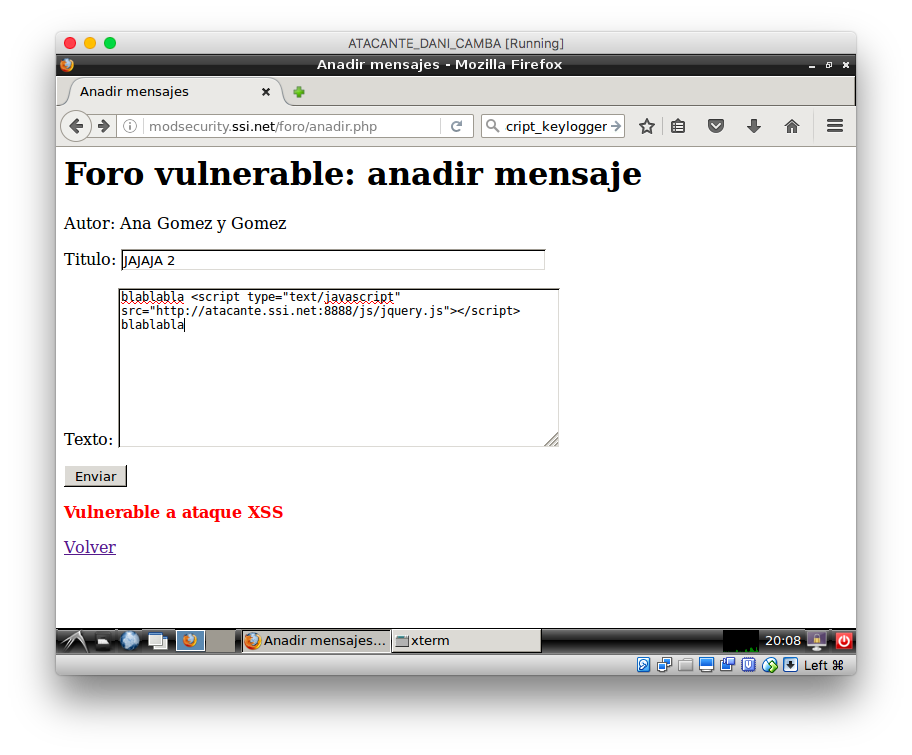
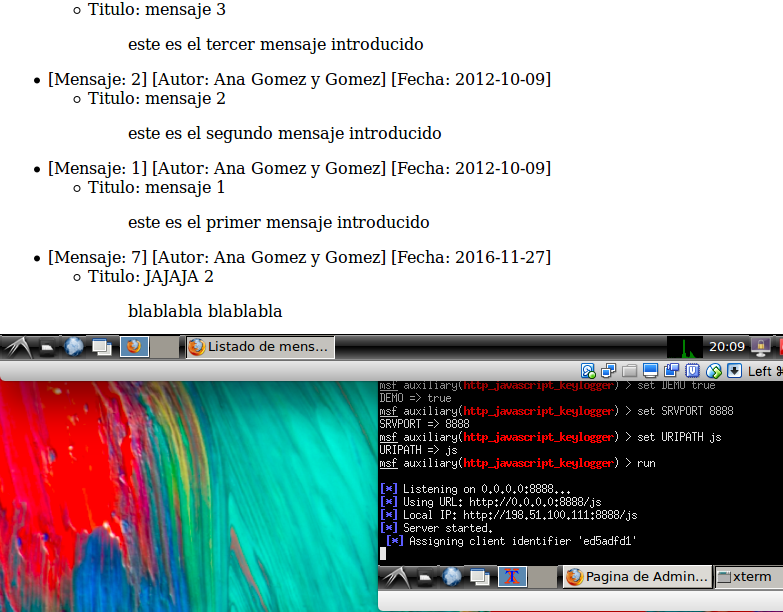
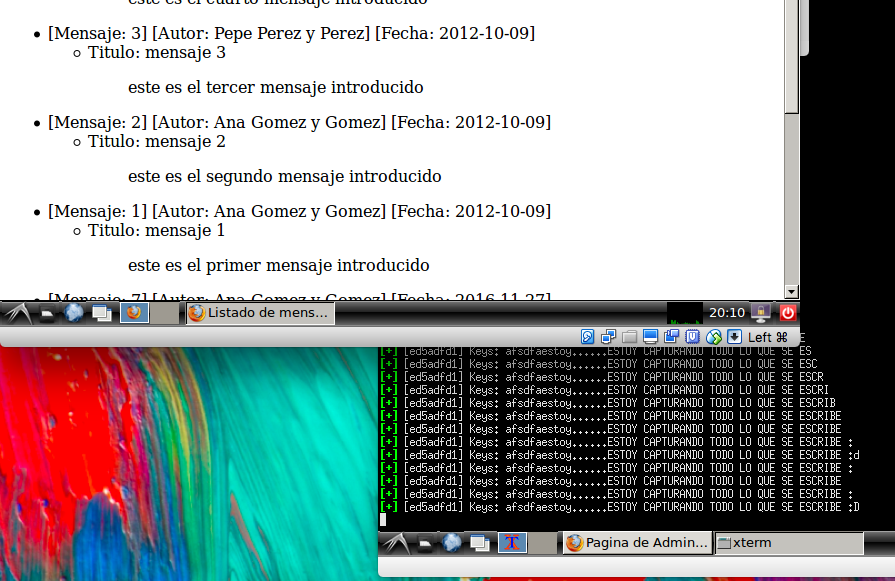

### FAKE LOGIN.
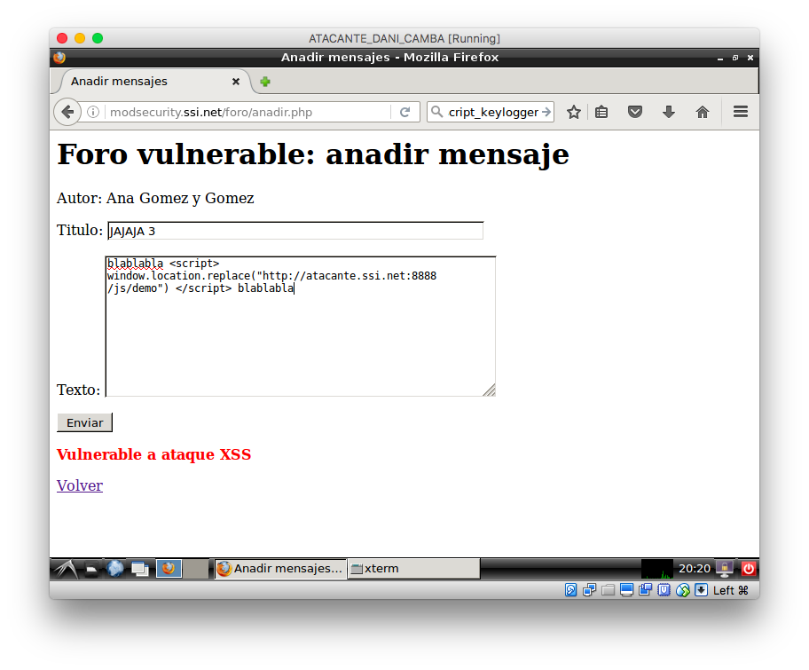
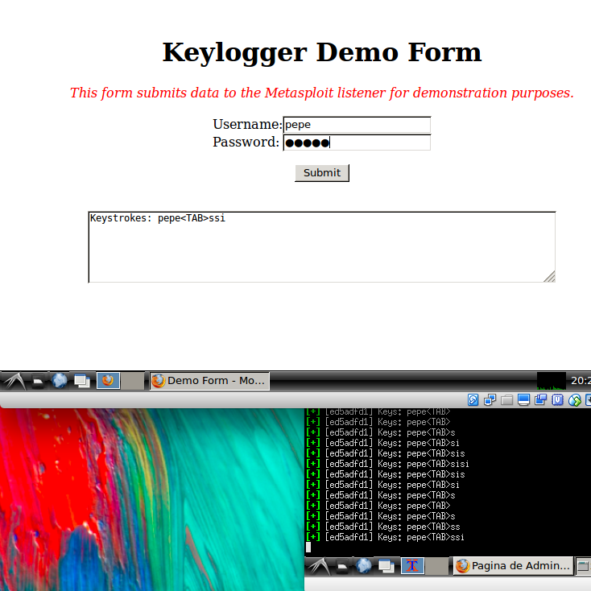

### MYSQL
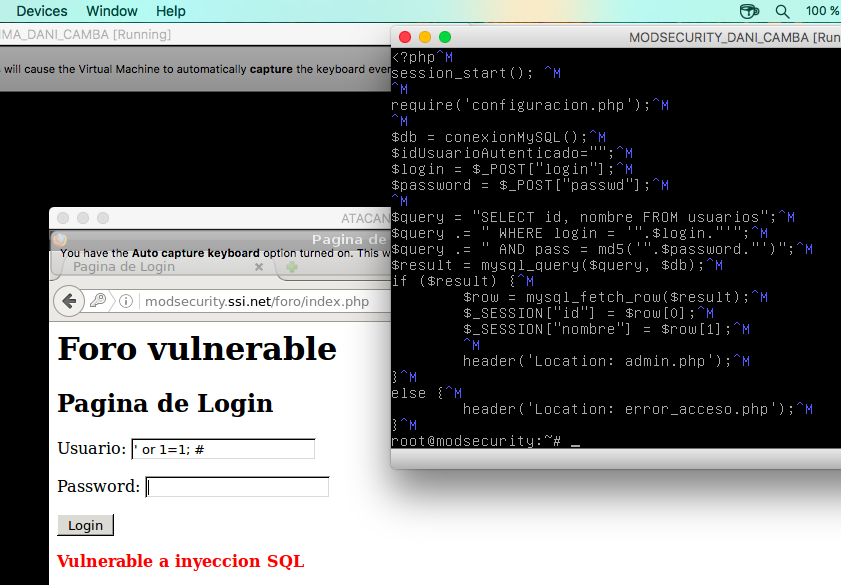
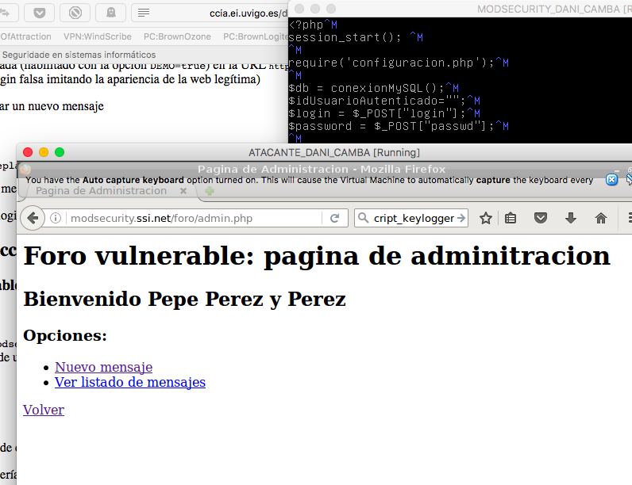
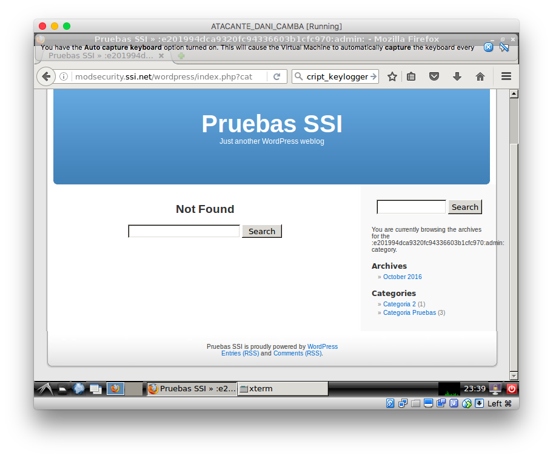

## 4.- MOD_SECURITY.

### SecureRules Detection Only

Si limitamos `Mod Security` a su modo de sólo detección, no detendrá ningún ataque, pero sí que registra todos los intentos anteriores en los logs: `error, access y modsec_audit`.

### SecureRules ON

Como era de esperar con `Mod Security` totalmente activo, los ataques previos son bloqueados, rediriguiendonos a una página de **_Forbidden_**.

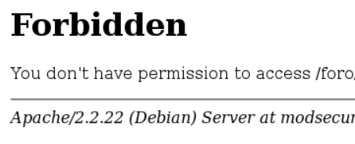