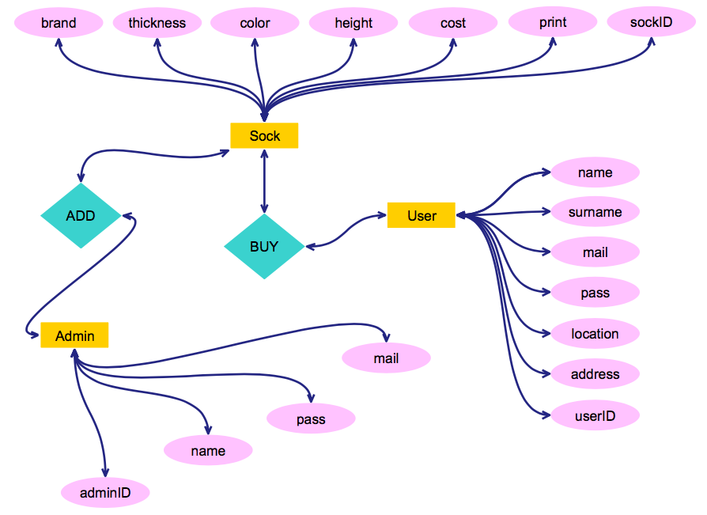
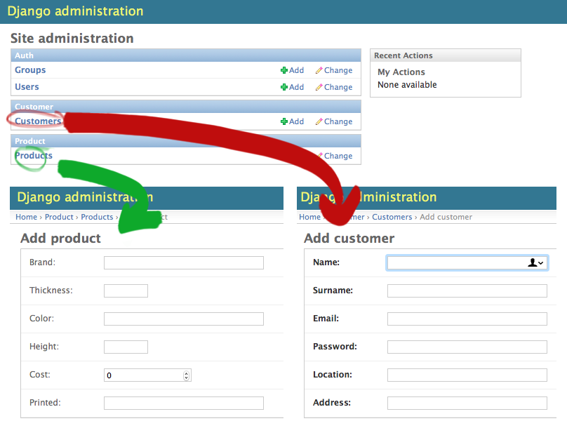

# Un negocio en Django.  (Lab2)

> Daniel Camba Lamas.

###Negocio.

*Una tienda de calcetines.*

###Dibuja el diagrama E-R, para tu producto.

  

###Desarrolla el modelo en Django escribiendo una clase en “model.py”. 

 

###Comprueba en  "/admin" que tu modelo ha sido registrado y tu modelo aparece en la WebApp del Admin.

 